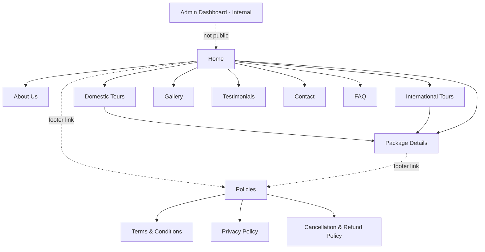
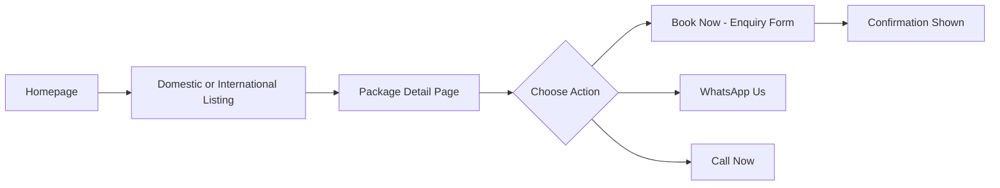
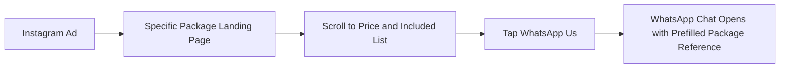
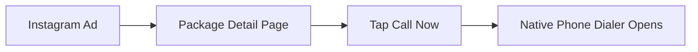
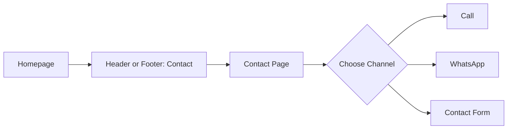
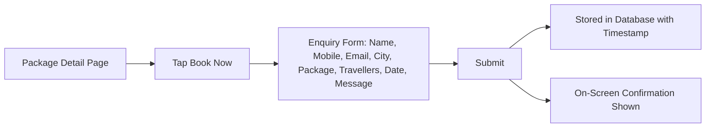
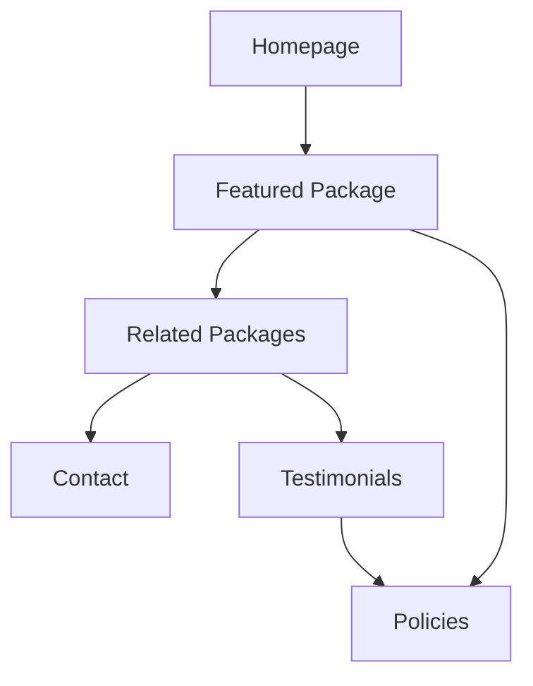

# Sangam Tours — Information Architecture Document

**Internal Reference Document | Version 1.0**
**Prepared for:** UI/UX Designers, Frontend Developers, Backend Developers, AI Coding Agents (Cursor), and Product Managers
**Companion to:** 01-brand-strategy.md, 02-user-personas.md
**Purpose:** This document defines the structural skeleton of www.sangamtours.com — how pages are organised, how they connect, and how users and search engines move through them. It does not repeat brand positioning, voice, personas, or visual design decisions covered in the companion documents.

---

## 1. Purpose

This is the third document in the Sangam Tours project documentation set. Where 01-brand-strategy.md defines *why* the site should feel a certain way and 02-user-personas.md defines *who* is using it and *what they need*, this document answers one question only:

**How is the website organised?**

It exists so that designers know what pages to design, developers know what routes to build, and AI coding agents have an unambiguous structural reference that removes guesswork about page order, navigation depth, and URL conventions. Every later document (wireframes, design system, technical spec) builds on the skeleton defined here.

---

## 2. Website Goals (Architectural Perspective)

| Goal | Architectural Implication |
|---|---|
| Convert ad traffic into enquiries | Package pages must be reachable in one or two taps from any entry point, with CTAs never more than one scroll away |
| Showcase the full tour catalogue clearly | Domestic and International tours are separated at the top level, not merged into one long list |
| Build trust quickly | Trust signals (testimonials, policies, "Since 1979") are structurally close to conversion points, not isolated on one page |
| Support mobile, ad-driven visitors | Navigation stays shallow — no page should require more than 2 taps from the homepage |
| Give the client full content control | Every editable element (tours, prices, dates, images, testimonials, gallery) maps to a defined Admin Dashboard section |
| Keep the structure scalable | New packages, and new legal or informational pages, should slot into the existing hierarchy without restructuring it |

---

## 3. Website Hierarchy

### 3.1 Sitemap Diagram

### 3.2 Nested Page List

- **Home**
  - **About Us**
  - **Domestic Tours** (listing)
    - Package Details (one page per domestic package, e.g. Konkan Monsoon, Goa Special, South India, Ayodhya Yatra, Andaman, Kerala–Kanyakumari–Rameshwaram, Rajasthan)
  - **International Tours** (listing)
    - Package Details (one page per international package, e.g. Leh Ladakh, Vietnam & Bali, Singapore–Thailand–Malaysia, Bhutan, Nepal)
  - **Gallery**
  - **Testimonials**
  - **FAQ**
  - **Contact**
  - **Policies** (footer group, no listing page of its own — see §3.3)
    - Terms & Conditions
    - Privacy Policy
    - Cancellation & Refund Policy
  - **Admin Dashboard** (internal, authenticated, not part of public navigation)

> **Note:** Leh Ladakh is priced with "+ Airfare" and includes air permits typical of high-altitude domestic travel, but it is treated as a **Domestic** package for navigation purposes since it stays within India. International classification is reserved for packages requiring passports (Vietnam & Bali, Singapore–Thailand–Malaysia, Bhutan, Nepal).

### 3.3 Policies Grouping Rule

Terms & Conditions, Privacy Policy, and Cancellation & Refund Policy are **not** given a parent "Policies" landing page. They are accessed directly as three separate footer links. This avoids adding an unnecessary click for users who want one specific policy (most often Cancellation & Refund, per persona research in 02-user-personas.md).

---

## 4. Navigation System

### 4.1 Primary Navigation (Header)

| Item | Links To |
|---|---|
| Home | `/` |
| Domestic Tours | `/domestic` |
| International Tours | `/international` |
| Gallery | `/gallery` |
| About | `/about` |
| Contact | `/contact` |

Testimonials and FAQ are intentionally excluded from the primary header to keep it short (6 items max, per accessibility guidance in 02-user-personas.md). They surface as homepage sections and footer links instead.

### 4.2 Secondary Navigation

Used only within listing pages (Domestic Tours, International Tours) as filter/sort controls — not a separate menu system. Example: within `/domestic`, secondary controls filter by destination type (hills, coast, pilgrimage) or by upcoming date. This is navigation *within* a page, not a second menu layer.

### 4.3 Footer Navigation

| Column | Links |
|---|---|
| Explore | Domestic Tours, International Tours, Gallery, Testimonials |
| Company | About Us, Contact, FAQ |
| Legal | Terms & Conditions, Privacy Policy, Cancellation & Refund Policy |
| Reach Us | Phone numbers, WhatsApp link, Email, Nagpur office address, Business hours |

### 4.4 Sticky Navigation Behaviour

- Header: compresses on scroll (logo + hamburger only on mobile) but remains visible at all times — never hides on scroll, since the phone number and WhatsApp access live here.
- Package pages carry an additional **sticky CTA bar** (Book Now / WhatsApp Us / Call Now) pinned to the bottom of the mobile viewport, independent of the header, active from the moment the user scrolls past the hero section.

### 4.5 Mobile Navigation

- Collapses to a hamburger menu containing the same six primary items plus Testimonials and FAQ.
- Phone number and WhatsApp icon remain visible in the mobile header outside the hamburger menu at all times — these are not buried behind a menu tap, consistent with the "no-friction access" value in 01-brand-strategy.md.

### 4.6 Search

Not required. The catalogue (12+ packages) is small enough that browsing via Domestic/International listings, combined with lightweight filters (§4.2), fully replaces the need for a search bar. This keeps the header simpler for lower-technical-literacy users.

### 4.7 Breadcrumb Usage

Breadcrumbs appear only on Package Detail pages, to reinforce the path back to the correct listing:

`Home / Domestic Tours / Konkan Monsoon`
`Home / International Tours / Bhutan`

Breadcrumbs are omitted on Home, About, Gallery, Testimonials, Contact, and FAQ, since these are one level deep and a breadcrumb there would add clutter without aiding orientation.

### 4.8 Navigation Principles

1. No page sits more than two taps from the homepage.
2. The header never grows past six primary items.
3. Phone and WhatsApp access are always visible, never nested.
4. Every navigation label uses plain, literal language — no clever renaming of "Contact" or "Tours."
5. Filtering happens within listing pages, not through a proliferation of new URLs or menu items.

---

## 5. Page Inventory

| Page | Purpose | Primary Audience | Primary CTA | Secondary CTA | SEO Priority |
|---|---|---|---|---|---|
| Home | Orient new visitors, surface featured packages, establish trust fast | All segments, especially ad-driven first-time visitors | WhatsApp Us | View Packages | High |
| Domestic Tours | Browse all domestic packages | Families, seniors, budget-conscious groups | View Package | WhatsApp Us | High |
| International Tours | Browse all international packages | Couples, younger travellers, groups with passports | View Package | WhatsApp Us | High |
| Package Details | Convert an interested visitor into an enquiry | All segments, arriving mostly via ads | Book Now | WhatsApp Us / Call Now | Critical (one page per package) |
| About Us | Build long-form trust and credibility | Comparison-shopping visitors, family decision-makers | WhatsApp Us | View Packages | Medium |
| Gallery | Provide visual proof of real trips | Visually-driven browsers, younger couples | View Packages | WhatsApp Us | Medium |
| Testimonials | Provide social proof at decision point | Hesitant or comparison-shopping visitors | WhatsApp Us | View Packages | Medium |
| FAQ | Resolve common objections without a call | Lower-confidence or research-first visitors | WhatsApp Us | Contact | Low |
| Contact | Provide every possible way to reach the company | All segments, especially seniors preferring calls | Call Now | WhatsApp Us | Medium |
| Terms & Conditions | Legal transparency | All segments (rarely visited directly) | — | — | Low |
| Privacy Policy | Legal transparency | All segments (rarely visited directly) | — | — | Low |
| Cancellation & Refund Policy | Address a named top pain point pre-booking | Hesitant visitors near the booking decision | WhatsApp Us | — | Low |
| Admin Dashboard | Internal content and lead management | Sangam Tours staff only | — | — | Not applicable (noindex) |

---

## 6. Homepage Architecture

Order of sections, top to bottom:

1. **Hero**
   - *Purpose:* Immediate orientation and emotional hook.
   - *Primary Message:* "Since 1979" credibility + core promise of hassle-free group travel.
   - *Primary CTA:* WhatsApp Us.
   - *Dependencies:* None (first section, must load fast for ad traffic).

2. **Trust Strip**
   - *Purpose:* Reinforce credibility immediately below the fold.
   - *Primary Message:* Years in operation, Tour Manager on every trip, number of happy travellers/testimonials.
   - *Primary CTA:* None (informational).
   - *Dependencies:* Testimonials data source.

3. **Featured / Upcoming Packages**
   - *Purpose:* Surface the highest-priority, soonest-departing packages.
   - *Primary Message:* "Book your next trip" with live dates and prices.
   - *Primary CTA:* View Package.
   - *Dependencies:* Admin-managed package data, sorted by departure date.

4. **Domestic vs International Split**
   - *Purpose:* Route visitors into the correct catalogue quickly.
   - *Primary Message:* Two clear entry points into the full listings.
   - *Primary CTA:* View Domestic Tours / View International Tours.
   - *Dependencies:* None.

5. **Why Sangam Tours**
   - *Purpose:* Summarise core values (from 01-brand-strategy.md) as scannable highlights.
   - *Primary Message:* Tour Manager, transparent pricing, home-style meals, since-1979 reliability.
   - *Primary CTA:* None (informational).
   - *Dependencies:* None.

6. **Testimonials Highlight**
   - *Purpose:* Social proof before the visitor is asked to commit.
   - *Primary Message:* Rotating selection of 3–4 testimonials representing different personas.
   - *Primary CTA:* View All Testimonials.
   - *Dependencies:* Admin-managed testimonial data.

7. **Gallery Preview**
   - *Purpose:* Visual proof of real trips.
   - *Primary Message:* A curated image grid linking to the full Gallery.
   - *Primary CTA:* View Gallery.
   - *Dependencies:* Admin-managed gallery/image data.

8. **FAQ Snippet**
   - *Purpose:* Pre-empt common objections without navigation.
   - *Primary Message:* 3–4 top questions with short answers.
   - *Primary CTA:* View All FAQs.
   - *Dependencies:* FAQ content set.

9. **Final CTA Band**
   - *Purpose:* Last conversion opportunity before the footer.
   - *Primary Message:* Direct invitation to enquire.
   - *Primary CTA:* Book Now / WhatsApp Us / Call Now (all three, equal weight).
   - *Dependencies:* None.

10. **Footer**
    - *Purpose:* Navigation safety net, legal access, contact details.
    - *Primary Message:* N/A (utility section).
    - *Primary CTA:* None.
    - *Dependencies:* None.

---

## 7. Package Page Architecture

This is the highest-priority template in the site, since nearly all ad traffic lands here. Order of sections:

1. **Hero** — Package name, destination summary, one strong image or short video.
2. **Price** — Headline price with GST/airfare qualifiers as stated in source data (e.g. "+ Airfare", "+ GST").
3. **Quick Facts** — Duration, destinations covered, group type suitability, departure city.
4. **Tour Dates** — Confirmed departure date range(s); supports multiple future departures per package.
5. **Overview** — Short scene-setting description of the trip.
6. **Highlights** — Bullet list of standout experiences.
7. **Itinerary** — Day-by-day breakdown.
8. **Included** — Structured list (accommodation, meals, transport, Tour Manager, permits, etc.).
9. **Excluded** — Structured list (flights, personal expenses, insurance, entry tickets where applicable).
10. **Gallery** — Destination-specific images for this package.
11. **Testimonials** — Reviews relevant to this package or destination type, where available; falls back to general testimonials otherwise.
12. **FAQ** — Package-specific or destination-specific questions, where applicable.
13. **CTA** — Book Now / WhatsApp Us / Call Now, repeated here even though the sticky bar also carries it.
14. **Policies** — Direct links to Cancellation & Refund Policy and Terms & Conditions.
15. **Related Packages** — 3–4 other packages in the same category (Domestic or International).

This order is fixed across **every** package page. No package page may reorder, omit, or add sections outside this structure — see §13, Rule 6.

---

## 8. User Flows

### 8.1 Homepage → Package → Enquiry

### 8.2 Instagram Ad → Landing Page → WhatsApp

### 8.3 Instagram Ad → Package → Call

### 8.4 Homepage → Contact

### 8.5 Package → Form Submission

---

## 9. URL Structure

| Page Type | URL Pattern | Example |
|---|---|---|
| Home | `/` | `/` |
| About | `/about` | `/about` |
| Domestic Listing | `/domestic` | `/domestic` |
| International Listing | `/international` | `/international` |
| Package Detail | `/packages/{package-slug}` | `/packages/leh-ladakh`, `/packages/kerala-kanyakumari-rameshwaram` |
| Gallery | `/gallery` | `/gallery` |
| Testimonials | `/testimonials` | `/testimonials` |
| FAQ | `/faq` | `/faq` |
| Contact | `/contact` | `/contact` |
| Terms & Conditions | `/terms-and-conditions` | `/terms-and-conditions` |
| Privacy Policy | `/privacy-policy` | `/privacy-policy` |
| Cancellation & Refund Policy | `/cancellation-and-refund-policy` | `/cancellation-and-refund-policy` |
| Admin Dashboard | `/admin` | `/admin` (authenticated, noindex) |

**Naming conventions:**

- All URLs are lowercase, hyphen-separated, no underscores or camelCase.
- Package slugs are derived from the package name in the admin panel (e.g. "Singapore • Thailand • Malaysia" → `/packages/singapore-thailand-malaysia`), auto-generated but editable by the admin to avoid awkward auto-slugs.
- No package appears under both `/domestic/...` and `/packages/...` — all package details live under the single flat `/packages/{slug}` path regardless of category, keeping links stable even if a package's category is reclassified later. Category listing pages simply link *to* these URLs; they do not nest them.
- Legal page URLs spell out the full policy name rather than using abbreviations, for clarity and SEO.

---

## 10. CTA Strategy

**Primary CTA:** Book Now (opens the Enquiry Form). Represents the highest-intent, most trackable conversion path since every submission is stored with a timestamp for follow-up.

**Secondary CTAs:** WhatsApp Us and Call Now. Per 02-user-personas.md, these are **not** subordinate in visual treatment — they are equal-weight alternatives to Book Now, since WhatsApp and phone are the dominant contact channels for this audience. "Secondary" here refers to their position in this document's terminology only, not their visual priority.

**Placement rules:**

- All three CTAs appear together at the bottom of every Package Detail page (§7, step 13) and in the sticky mobile CTA bar.
- The homepage Final CTA Band (§6, step 9) repeats all three.
- Listing pages (Domestic/International) do not carry the three-CTA cluster — each package card there carries a single "View Package" action, deferring the conversion CTAs to the Package Detail page itself.
- The Contact page leads with Call Now as its primary CTA (§5), reflecting that visitors reaching Contact directly are more likely to want to speak with someone.

**Consistency:** The three CTA labels — "Book Now," "WhatsApp Us," "Call Now" — are fixed strings used identically everywhere they appear. No page introduces a variant phrasing (e.g. "Enquire Now," "Chat With Us") for these three actions.

**Hierarchy:** Book Now, WhatsApp Us, and Call Now sit at the top of the CTA hierarchy. "View Package," "View Domestic Tours," "View International Tours," and "View Gallery" sit one level below, functioning as navigational CTAs that move a visitor closer to the top-tier three, not as conversions in themselves.

---

## 11. Internal Linking Strategy

**Rules:**

1. Every Package Detail page links to 3–4 Related Packages (§7, step 15), keeping visitors inside the site rather than exiting after one package.
2. Every Package Detail page links directly to the Cancellation & Refund Policy and Terms & Conditions (§7, step 14) — not just via the footer — since this is a named pre-booking hesitation point (02-user-personas.md, §11).
3. Testimonials are linked from the Homepage, every Package Detail page, and the dedicated Testimonials page — never confined to one location, reinforcing trust across every entry point.
4. The Gallery links back to relevant Package Detail pages where an image set corresponds to a specific package.
5. The Contact page is reachable from the header, footer, and the FAQ page (for visitors whose question isn't answered there).
6. No page is an internal linking dead-end: every page provides at least one path forward to a Package listing or a conversion CTA.

---

## 12. Content Hierarchy Rules

1. **Trust before detail.** On every page, credibility signals (since 1979, Tour Manager, testimonials) appear before deep informational content.
2. **Pricing before long description.** On Package Detail pages, Price (step 2) appears immediately after the Hero, well before Itinerary or Overview.
3. **Inclusions before exclusions, both above the fold context.** Included/Not Included must never require excessive scrolling to reach.
4. **Important FAQs before policies.** Where both appear on a page, FAQ content precedes legal/policy links, since FAQs resolve doubt while policies confirm it.
5. **Simple scanning over dense paragraphs.** Structured lists and tables are preferred over long-form paragraphs wherever the content is inherently listable (inclusions, quick facts, itinerary days).
6. **Avoid deep nesting.** No content should require expanding more than one level of disclosure (e.g. one accordion level for itinerary days is acceptable; nested accordions are not).
7. **Repeat, don't relocate, trust signals.** Key trust elements (since 1979, Tour Manager) should be repeated across pages rather than assumed to be seen once.

---

## 13. AI Architecture Rules

These rules apply to Cursor and any AI coding agent implementing this structure.

1. Never invent new top-level pages beyond those defined in §3.
2. Do not change the primary navigation hierarchy defined in §4.1 without an explicit updated requirement.
3. Reuse the single Package Detail page template (§7) for every package — never create a one-off layout for any individual package.
4. Keep the URL conventions in §9 exact — do not introduce alternate patterns (e.g. `/tour/{slug}` or `/domestic/{slug}`).
5. Maintain the fixed section order defined in §7 for every Package Detail page; do not reorder, skip, or insert sections per-package.
6. Preserve CTA label consistency (§10) — "Book Now," "WhatsApp Us," "Call Now" must never be renamed or rephrased per page.
7. Avoid unnecessary navigation depth — no public page should sit more than two taps from the homepage.
8. Prefer shallow, flat routing (`/packages/{slug}`) over nested category routing.
9. Do not create a "Policies" landing page — Terms & Conditions, Privacy Policy, and Cancellation & Refund Policy remain three direct, independent routes (§3.3).
10. Do not add a search feature unless explicitly requested — filtering within listing pages is sufficient per §4.6.
11. Do not add breadcrumbs to one-level-deep pages (Home, About, Gallery, Testimonials, Contact, FAQ) — reserve breadcrumbs for Package Detail pages only.
12. Keep the header to a maximum of six primary items, per §4.8.
13. Ensure the sticky mobile CTA bar is present on every Package Detail page and does not obstruct the three-CTA cluster already in the page body.
14. Do not merge Domestic and International listings into a single catalogue page — they remain two distinct listing pages linking into the same flat package URL space.
15. Do not build the Admin Dashboard as part of the public navigation structure — it is a separate, authenticated area outside §4's navigation system.
16. When adding a new package in the admin panel, ensure it automatically appears in the correct listing (Domestic or International) and in the Related Packages logic — do not require manual linking per page.
17. Do not add new footer columns or reorganise the four defined groups in §4.3 without an explicit requirement update.
18. Internal linking rules in §11 are mandatory for every new Package Detail page created, including future packages added after launch.
19. Treat this document as authoritative for structure; if a conflict arises with a future wireframe or design system document regarding page order or navigation, flag it rather than silently resolving it.
20. Do not fabricate additional legal pages (e.g. a separate Shipping Policy, Refund Policy split from Cancellation) beyond the three defined in §3.

---

## 14. Key Takeaways

**Architecture philosophy:** The site is built around a single, high-priority template — the Package Detail page — surrounded by a small set of supporting pages (About, Gallery, Testimonials, FAQ, Contact) and three fixed legal pages. Nothing in the structure exists that doesn't either drive a visitor toward a package or support the credibility needed to convert one.

**Navigation philosophy:** Shallow and literal. Six header items, no search, no nested menus, breadcrumbs reserved for the one page type that needs them. Phone and WhatsApp access are always visible, never hidden behind navigation.

**Hierarchy philosophy:** Trust and price lead; detail follows. This applies at every scale, from the homepage section order down to the order of fields within a single Package Detail page.

**User flow philosophy:** Every flow assumes an interrupted, ad-driven mobile visitor. The distance from ad click to Book Now / WhatsApp Us / Call Now is kept as short as structurally possible, with Related Packages and internal links catching visitors who aren't ready to convert on the first package they see.

**Critical implementation rules:** One Package Detail template reused for all packages; flat `/packages/{slug}` URLs regardless of category; three CTAs with equal visual and structural weight everywhere they appear; Cancellation & Refund Policy linked directly from every package, not buried in the footer alone; Admin Dashboard kept entirely outside the public navigation system.